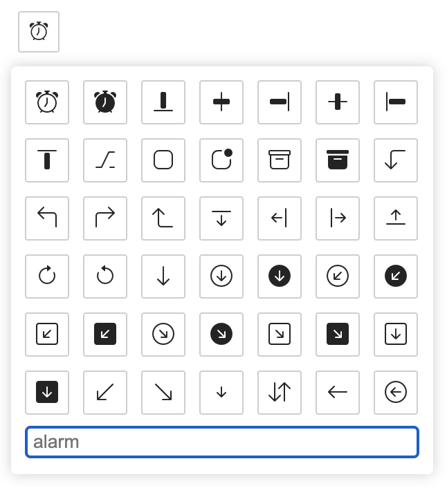

### Usage

```js
import IconPicker from "bootstrap-icon-selector";
import { useState } from "react";

function App() {
  const [icon, setIcon] = useState("");
  return (
    <div className="App">
      <i className={icon}></i>
      <IconPicker onChange={(val) => setIcon(val)} />
    </div>
  );
}

export default App;
```

### Props

```javascript
onChange function
buttonClass string
```
